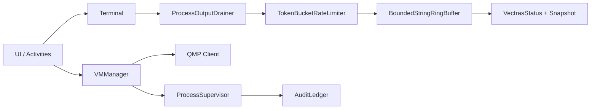

# Vectras VM Android — Plataforma de Virtualização Determinística

> **Resumo (EN):** This release hardens process execution and logging paths to prevent deadlocks/zombies, introduces deterministic process supervision with failover, modernizes Android storage permissions (Scoped Storage/SAF), and adds operational audit ledgering.


---

## 🎯 Visão do produto
O Vectras VM Android executa VMs com foco em mobilidade, compatibilidade e estabilidade operacional. Nesta atualização, o foco foi tornar o runtime resiliente sob pressão (flood de logs, processos long-running e encerramento controlado).

## 🧱 Arquitetura (alto nível)


## 🚀 Como rodar
1. Configure Android SDK/NDK e JDK 17.
2. Build debug:
   ```bash
   ./gradlew :app:assembleDebug
   ```
3. Testes unitários:
   ```bash
   ./gradlew :app:testDebugUnitTest
   ```

## 📚 Documentação técnica
- [Arquitetura](docs/ARCHITECTURE.md)
- [Segurança](docs/SECURITY.md)
- [Operações](docs/OPERATIONS.md)
- [Release Notes](RELEASE_NOTES.md)
- [Changelog](CHANGELOG.md)
